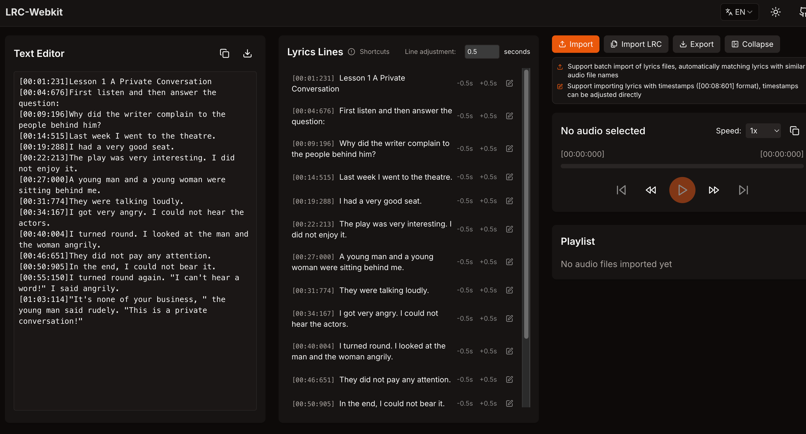

# LRC-Webkit

强大的 LRC 歌词编辑器，基于 Next.js 和 Shadcn UI 构建。

简体中文 | [English](./README.md)



## 特性

- 🎵 音频导入和播放
  - 支持多种音频格式
  - 支持批量导入, 批量导出
  - 播放列表管理

- 📝 LRC 编辑
  - 实时时间戳标记
  - 支持键盘快捷键
  - 时间戳微调功能
  - 导入已有 LRC 文件

- 🌐 国际化
  - 支持英文
  - 支持中文
  - 易于添加更多语言

- 🎨 现代界面
  - 暗色/亮色模式
  - 响应式设计
  - 简洁直观的界面

## 技术栈

- [Next.js](https://nextjs.org/) - React 框架
- [Shadcn UI](https://ui.shadcn.com/) - UI 组件库
- [TypeScript](https://www.typescriptlang.org/) - 类型安全
- [Tailwind CSS](https://tailwindcss.com/) - 样式
- [next-intl](https://next-intl-docs.vercel.app/) - 国际化

## 键盘快捷键

- `Space` - 为下一行添加时间戳
- `←/→` - 调整当前行时间戳

## 开始使用

1. 克隆仓库
```bash
git clone https://github.com/lzw10168/lrc-webkit.git
```

2. 安装依赖
```bash
pnpm install
```

3. 启动开发服务器
```bash
pnpm dev
```

4. 打开浏览器
```
http://localhost:3000
```

## 贡献

欢迎提交 Issue 和 Pull Request！

## 许可证

[MIT 许可证](./LICENSE) 
